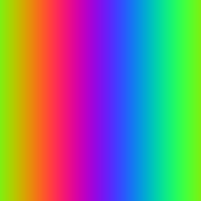

# SQL Image Renderer

Rendering bitmap images using postgres. This is dumb, but I wanted to see if I could render images with a stored procedure.

## Usage

1. `docker-compose up` to bring up db
2. `./migrate.sh` to run migration
3. Create python venv and install requirements.txt
4. Load bitmap to db using `python load_bitmap.py [path to image]`
5. Render bitmap from db using `python show_image.py [image_id]`

## Image Manipulation

Again, this is not optimal, but you can hypothetically manipulate images with SQL.

Here are a few example queries you can try inside `psql` once your database is seeded:

```sql
-- 1) Invert the colors of an existing image (id = 1)
UPDATE pixels
SET r = 255 - r,
    g = 255 - g,
    b = 255 - b
WHERE image_id = 1;

-- 2) Retrieve a raw RGBA bitmap for the image as hex
SELECT encode(image_to_bitmap(1), 'hex');

-- 3) Create a brand-new image from a bitmap (64×64)
--    Replace <hex_bitmap> with the hex string produced by any tool.
SELECT bitmap_to_image(
    'My new image',
    decode('<hex_bitmap>', 'hex'),
    64,
    64
);
```


## Image Creation

You can create a blank image and define an image however you wish using a transaction:


### Rainbow Gradient

```sql
-- Create a 256×256 rainbow gradient where hue shifts left→right
BEGIN;

WITH new_img AS (
    INSERT INTO images(name) VALUES ('Rainbow gradient') RETURNING image_id
)
INSERT INTO pixels(image_id, x, y, r, g, b, a)
SELECT new_img.image_id,
       x,
       y,
       ROUND(127.5 + 127.5 * SIN(2 * PI() * x / 256))::INT  AS r,
       ROUND(127.5 + 127.5 * SIN(2 * PI() * x / 256 + 2 * PI() / 3))::INT AS g,
       ROUND(127.5 + 127.5 * SIN(2 * PI() * x / 256 + 4 * PI() / 3))::INT AS b,
       255                                                      AS a
FROM new_img,
     generate_series(0, 255) AS x,
     generate_series(0, 255) AS y;

COMMIT;
```

Produces



## Radial Grayscale


```sql
BEGIN;

WITH new_img AS (
    INSERT INTO images(name) VALUES ('Radial grayscale') RETURNING image_id
)
INSERT INTO pixels(image_id, x, y, r, g, b, a)
SELECT new_img.image_id,
       x,
       y,
       intensity,
       intensity,
       intensity,
       255
FROM new_img,
     generate_series(0, 255) AS x,
     generate_series(0, 255) AS y,
     LATERAL (
         SELECT ROUND(GREATEST(0, 255 - sqrt(power(x - 128, 2) + power(y - 128, 2))))::INT AS intensity
     ) s;

COMMIT;
```

Produces


### Sunset over sea

```sql
BEGIN;

-- 1) Create the image record
INSERT INTO images(name) VALUES ('Sunset over Sea');

-- 2) Sky gradient (top half)
WITH img AS (SELECT MAX(image_id) AS id FROM images WHERE name = 'Sunset over Sea')
INSERT INTO pixels(image_id, x, y, r, g, b, a)
SELECT img.id,
       x,
       y,
       255                                              AS r,
       ROUND(100 + 155 * (63 - y)::NUMERIC / 63)        AS g,
       ROUND(200 +  55 * (63 - y)::NUMERIC / 63)        AS b,
       255                                              AS a
FROM img,
     generate_series(0, 127) AS x,
     generate_series(0, 63)  AS y;

-- 3) Sea gradient (bottom half)
WITH img AS (SELECT MAX(image_id) AS id FROM images WHERE name = 'Sunset over Sea')
INSERT INTO pixels(image_id, x, y, r, g, b, a)
SELECT img.id,
       x,
       y,
       0                                                AS r,
       ROUND( 80 * (y - 64)::NUMERIC / 63)              AS g,
       ROUND(150 + 105 * (y - 64)::NUMERIC / 63)        AS b,
       255                                              AS a
FROM img,
     generate_series(0, 127) AS x,
     generate_series(64,127) AS y;

-- 4) Sun (yellow/orange circle) – overwrite any existing sky pixels
WITH img AS (SELECT MAX(image_id) AS id FROM images WHERE name = 'Sunset over Sea')
INSERT INTO pixels(image_id, x, y, r, g, b, a)
SELECT img.id,
       x,
       y,
       255, 200, 0, 255
FROM img,
     generate_series(0,127) AS x,
     generate_series(0,127) AS y
WHERE power(x - 64, 2) + power(y - 40, 2) < power(20, 2)
ON CONFLICT (image_id, x, y)
DO UPDATE SET r = EXCLUDED.r,
              g = EXCLUDED.g,
              b = EXCLUDED.b,
              a = EXCLUDED.a;

COMMIT;
```

Produces


